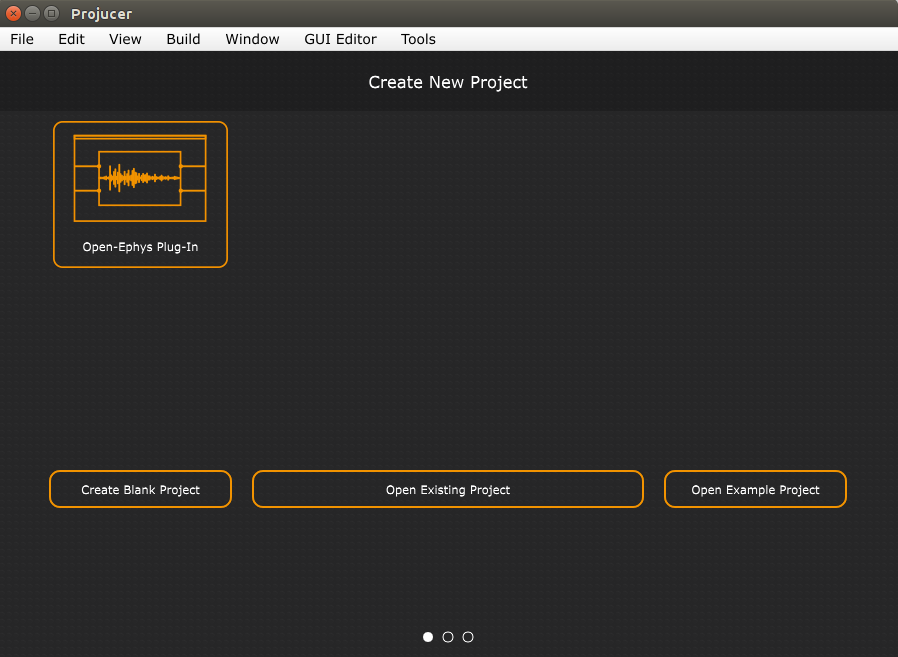
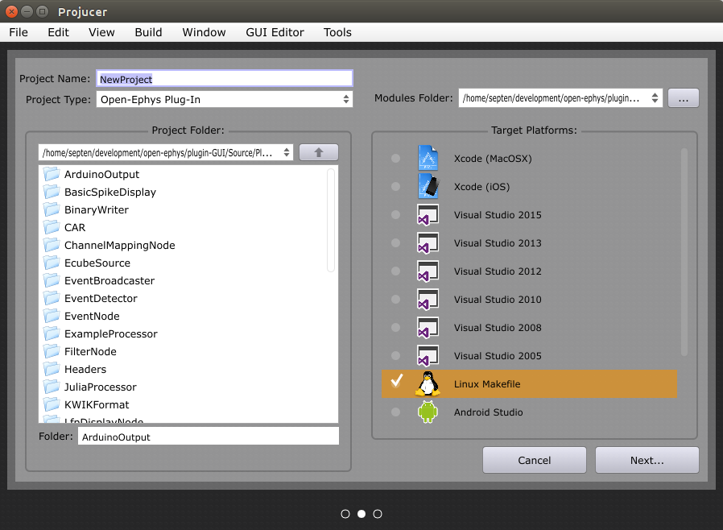
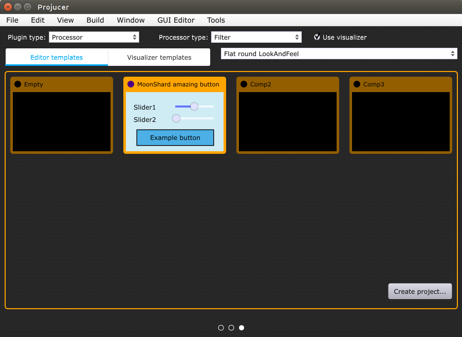
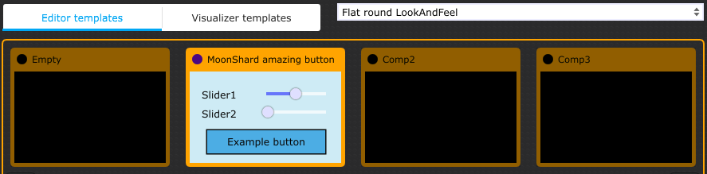
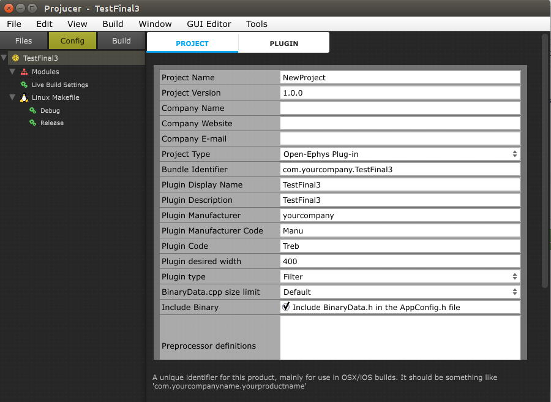
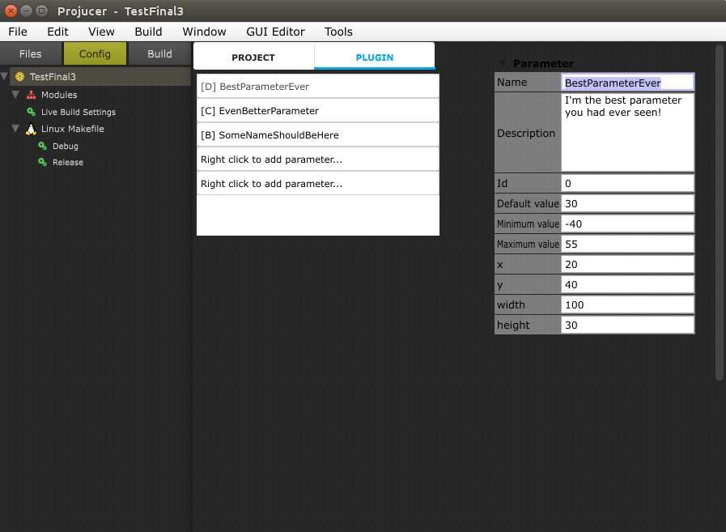
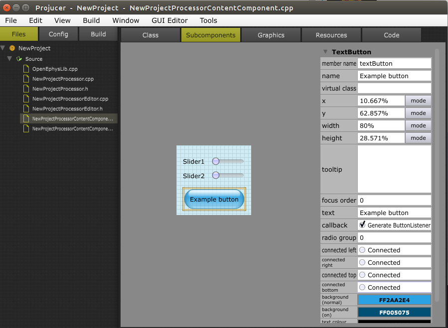

# Plugin Generator

Auto-generates source code for Open Ephys GUI Plugins.

*Author: Kirill Ambramov (Google Summer of Code 2016)*

**IMPORTANT:** The source code created by the Plugin Generator has not been updated to work with the GUI's more recent CMake build scheme. The recommended way to create a new plugin is to use the [OEPlugin](https://github.com/open-ephys-plugins/oeplugin) template repository. We'll keep the Plugin Generator repository around as a reference, or in case someone wants to revive it.

## Overview

The Plugin Generator is based on a modified version of Juce's "Projucer" application.

Features:

* Auto-generate source code templates for plugins
* Generate necessary build files (Now 100% support for Linux only. Still WIP for macOS and Windows)
* Generate content component files (the files that allow a user to create a plugin UI using a visual editor)
* Create and edit plugin parameters using parameter editor
* Create plugin using any template from the list of available plugin templates
* Select any LookAndFeel for plugin from the list of available LookAndFeels
* Edit different plugin options (i.e. width, description, etc.) on the fly

## Usage instructions

Once the application has been compiled for your platform of choice, follow these steps to create your plugin source code:

### Step 1

*Choose the "Open-Ephys Plug-in" tile to start the process of creating a plugin.*

### Step 2

*Enter the name of the plugin and change the directory of plugin if needed (By default it's plugin-GUI/Source/Plugins)*

### Step 3

On this screen, you can select which type of plugin you want to create, choose if you want to use Visualizer, select any LookAndFeel for your plugin, and select any template from which your plugin will be created.

*To finish the process of plugin creation click the "Create project" button.*

## Additional Details

### Plugin and processor types

You can select one of the following plugin types:

* Processor
* File Source
* Record Engine

If you’ve selected the Processor plugin, then you will be able to select which type of processor you want to create:

* Filter
* Source
* Sink

### Additional options

If you checked *Use visualizer* button, your plugin will also have the possibility to display some needed content in the tab or separate window (similar to the LFP Viewer plugin).

If you selected the Processor plugin with the Source type, then you will see a button *Use separate thread*. If you check this button and continue, the plugin of DataThread type will be created.

### ContentComponents

Plugin Generator creates for each Processor plugin it’s own ContentComponent file which can be edited using visual interface designer to add any buttons, sliders, images, etc.

If you have checked “Use visualizer” option, Plugin Generator will also create another one ContentComponent for Visualizer part of the plugin (the part that can be displayed either in the tab or separate window).

### Templates

You can select any available plugin template that will be used for your plugin. The template is just a ContentComponent, so choosing any template means that you will have inside your plugin exactly the copy of this template, which you can later configure and edit on your own if needed.

### LookAndFeel

You can select any LookAndFeel for your plugin from the list of available LookAndFeels. This LookAndFeel will be applied to the ContentComponent of your plugin editor and also for the Visualizer if you selected this option.

## Plugin Configuration

### Project

Here you can set some info for plugin if needed and configure some plugin options.

Most likely you might need “Plugin desired width” option. This option describes how much space your plugin’s editor will have in the signal chain of the Open Ephys GUI.

### Plugin parameters

When configuring your Processor plugin you might want to add some parameters to your plugin’s processor.

*Note*: A Parameter is a type of data structure which holds parameter type, default value of parameter, current value, etc. By using parameters you can get/set any values that you might need right from the plugin’s processor using getParameterVar(int parameterIndex, int parameterChannel), setParameter(int parameterIndex, float newValue) methods.

If you add any parameters there will be also created GUI component for each parameter, thus you will be able to edit parameters using GUI controls.

**Parameter Types:**

* **Boolean** - allows you to operate with boolean values that can have only True(1) and False(0) values.

* **Continuous** - using this parameter you operate with double values. You also need to set the range of possible values - minimum and maximum value for parameter.

* **Discrete** - using this parameter you will operate with integer values. You should set the list of the available values for this parameter.

* **Numerical** - this parameter type is simillar to the Continuous one and the biggest difference is only in the parameter’s view.

All parameters components by default are displayed at their default positions. If you want to change bounds of any parameter component - you can set their x, y, width, height values.

*NOTE:* Parameters components are displayed on the top of all plugin editor’s components. Thus your parameters will be displayed over the ContentComponent which you usually create using visual interface designer. So if you care of this you won’t have any overlapping problems.

### Content Components

If you want to change the GUI of the plugin - it's easy! Just go to the "Files" tab and select the [YOURPROCESSORNAME]ContentComponent.cpp file from the list of files.

Now you can edit any of existing GUI components, add any new, change colours etc.

